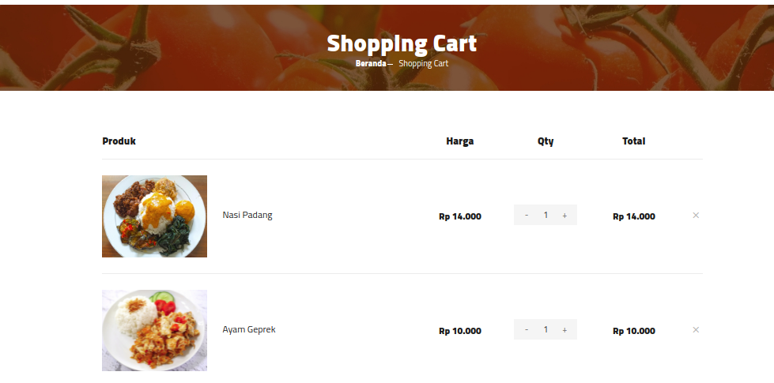
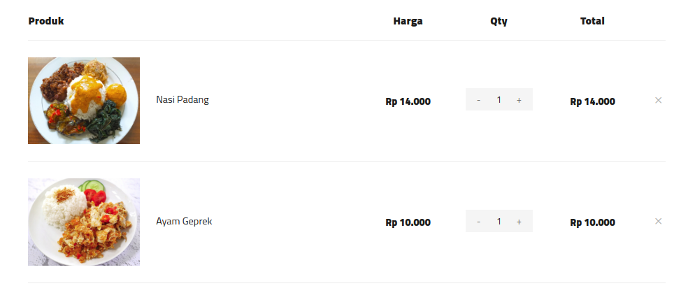
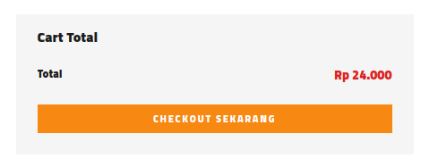
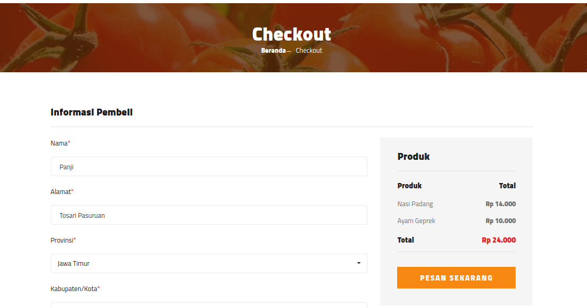
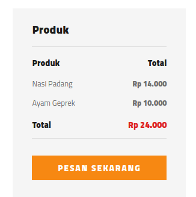

# Keranjang Pembelian

!!! attention "Peringatan"

    Halaman ini haya bisa di akses ketika user sudah login/terdaftar.

***

## Riwayat Pembelian

Anda dapat mengakses keranjang pembelian produk anda, keranjang akan dibagi dalam 4 tahap:

***

### 1. Daftar Produk

Daftar produk dalam hamalan cart berisi daftar produk dari produk yang siap dibeli.

***

### 2. Checkout

Tombol checkout akan mengarakan anda kedalam halaman check out, pada bagian ini akan berisi informasi dari total produk yang akan dipesan user.

***

### 2. Halaman Checkout

Untuk dapat membuat pesanan anda harus melengkapi data data diri seperti alamar dan nomor telephone. 

***

### 3. Tombol Pesan

Ketika anda sudah melengkapi data, barulah pesanan dapat dibuat dengan menekan tombol pesan.