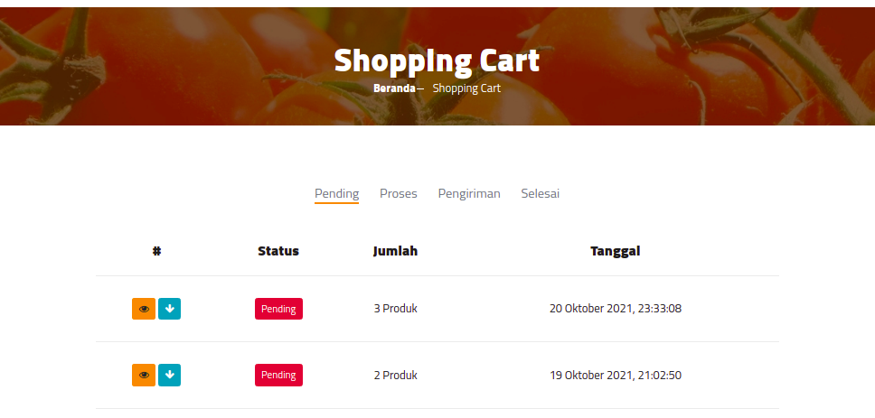
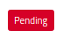
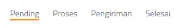
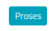
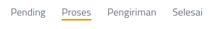
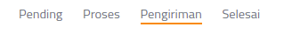
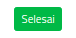
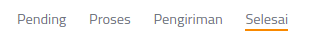
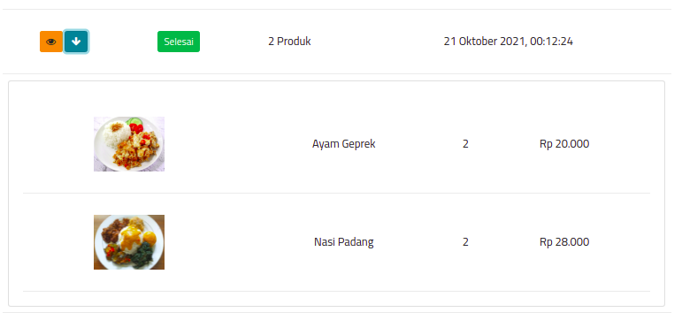

# Riwayat Pembelian

!!! attention "Peringatan"

    Halaman ini haya bisa di akses ketika user sudah login/terdaftar.

***

## Riwayat Pembelian

Anda dapat mengakses riwayat pembelian produk anda, riwayat akan dibagi dalam 4 status:

***

### 1. Pending

{ align=right }

Ketika pesanan dalam status pending itu berarti pesanan baru dibuat dan ``Admin`` belum mengkonfirmasi pesanan tersebut.

***

### 2. Proses

{ align=right }

Ketika pesanan dalam status proses itu berarti pesanan baru sedang diproses oleh ``Admin`` dan siap dikirimkan.

***

### 3. Pengiriman

{ align=right }

Ketika pesanan dalam status Pengiriman itu berarti pesanan sedang dalam pengiriman.

***

### 4. Selesai

{ align=right }

Ketika pesanan dalam status selesai itu berarti pesanan telah diterima oleh pelanggan.

***

### 5. Expand

Adapun fitur ``Expand`` digunakan untuk melihat detail dari pesanan, untuk melihat detail user harus menekan ``tombol arah panah bawah``.
