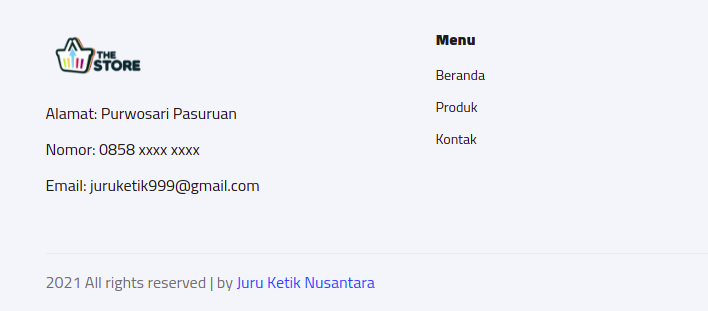
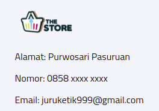
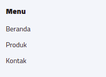
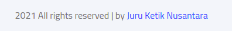

# Menu Footer
***

## Footer

Footer adalah bagian yang menampilkan informasi dasar aplikasi seperti:

### 1. Informasi Toko

Informasi detail toko seperti logo, alamat, nomor dan email toko.

### 2. Footer Menu

Footer menu adalah bagian navigasi yang berada pada footer.

### 3. Developer

Developer adalah informasi terkait pihak pengembang aplikasi.

