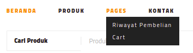
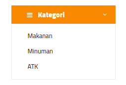
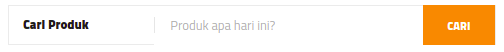
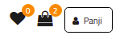
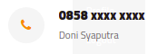

# Menu Header
***

## Navigasi

Navigasi dapat digunakan untuk berpindah ke halaman:

1. Beranda
2. Produk
3. Kontak

Adapun halaman

* Riwayat transaksi
* Cart

Dapat diakses ketika user sudah mempunyai akun.

***

## Kategori

Kategori dapat digunakan untuk mensortir produk berdasarkan kategori, beberapa contoh kategori seperti:

1. Makanan
2. Minuman
3. ATK

***

## Cari Produk

Anda dapat menggunakan Cari Produk untuk mencari beberapa produk yang dibutuhkan:

***

## Icon Nav

Icon Nav terdiri dari 2 icon yang dapat memberi informasi:

1. Icon hati berarti produk yang disukai/yang akan masuk daftar pembelian. 
2. Icon Tas Belajan berarti beberapa produk yang siap anda beli akan berada pada daftar pembelian. 

***

## Customer Service

Customer Service akan membantu anda untuk mengatasi beberapa kendala dalam masa berbelanja.

***